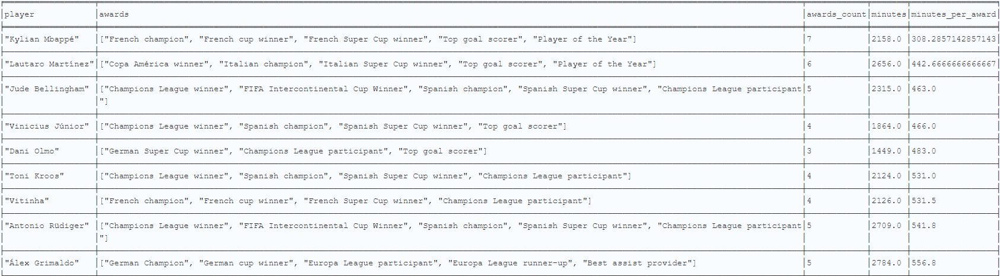

# Analysis of Ballon d'Or 2024 Nominees - Graph Database

A coursework project for **Semantic Networks** - a graph database for analyzing players nominated for the Ballon d'Or 2024.

## Project Description

This project provides a comprehensive graph-based analysis system for Ballon d'Or 2024 nominees, enabling complex queries about:

- player careers,
- achievements and awards won,
- seasonal statistics (goals, assists, expected goals, expected assists, etc.),
- relationships with clubs, outfitters, and sponsors.

The graph model allows relational analysis and report generation based on the data.

## Database Contents

### Node Types

- Player
- Club
- Country
- PlaceOfBirth
- Position
- Foot
- Outfitter
- Agent
- Award

### Relationship Types

- BORN_IN
- HAS_CITIZENSHIP
- PLAYS_AS
- PLAYS_WITH
- SPONSORED_BY
- REPRESENTED_BY
- WON
- TRANSFERRED
- STARTED_CAREER_AT

### Data Sources

Data was collected via web scraping from the following sources:

- [Kaggle - Match statistics 2023/2024](https://www.kaggle.com/datasets/willianoliveiragibin/ballon-dor-2024)
- [Transfermarkt - biographical data and transfers](https://www.transfermarkt.pl/)
- [Wikipedia - official Ballon d'Or results](https://en.wikipedia.org/wiki/2024_Ballon_d%27Or)

## Example Cypher Queries

The project includes a set of non-trivial queries in Cypher language, enabling analysis of the collected data.
The queries allow for evaluation of player efficiency, analysis of career paths, agent influence on player success, etc.

| Query                                           | Description                                                                         | File                                                 |
| ----------------------------------------------- | ----------------------------------------------------------------------------------- | ---------------------------------------------------- |
| **Multiple citizenships (non-Europe)**          | Find players with more than one citizenship, including at least one outside Europe. | `queries/players_multiple_citizenships_non_europe.cypher`  |
| **Outfitters with most awards**                 | List outfitters whose players won the most awards.                                  | `queries/top_outfitters_by_awards.cypher`            |
| **Average player height by country**            | List countries whose players have the highest average height, min/max, and range.   | `queries/players_height_by_country_stats.cypher`     |
| **Defensive profile players (low G+A)**         | List players with high minutes but minimal contribution to goals and assists.       | `queries/players_low_efficiency_high_minutes.cypher` |
| **Top playmakers (key passes per 90)**          | Find players with the highest number of key passes per 90 minutes.                  | `queries/top_playmakers_by_key_passes_per_90.cypher` |
| **TOP complete players**                        | List players with versatile profiles (offense, creativity, defense, dribbling).     | `queries/top_complete_players_all_aspects.cypher`    |
| **Top 5 tempo controllers**                     | List top 5 players with progressive passes and high pass accuracy.                  | `queries/top_5_tempo_controllers.cypher`             |
| **Loyalty and success - fewest clubs + awards** | List players who won the most awards while playing for the fewest clubs.            | `queries/loyal_winners_awards_by_clubs.cypher`       |
| **Underperformance vs xG + xA**                 | List players whose goals and assists are lower than the sum of xG + xA.             | `queries/underperformers_xgxa_vs_real_detailed.cypher` |
| **Awards efficiency in season 23/24**           | List players with awards in 23/24 and their minutes per award.                      | `queries/awards_efficiency_23_24.cypher`             |

### Example Query Results - Awards efficiency in season 23/24

Below are example results of a query that analyzes players in terms of the number of awards won in the 23/24 season relative to the number of minutes played.
This makes it possible to determine which players were most "efficient" - winning awards despite relatively few minutes on the pitch.

**Example query results**:

#### Result Interpretation - Example: Kylian Mbappé (season 23/24)

Kylian Mbappé won **7 awards** with only **2158 minutes** played in the season. Although the number of minutes is lower than many other players, it perfectly reflects the real situation from the season:

- Mbappé was partially **sidelined from the PSG squad** due to his decision not to extend his contract and his planned transfer to Real Madrid.
- Despite this, he remained extremely effective and influential - winning prestigious awards such as **Top goal scorer** and **Player of the Year**.
- The query accurately shows players who **even with limited minutes** were able to achieve above-average success.

## Project Structure

### Main Scripts

| File                         | Description                                                            |
| ---------------------------- | ---------------------------------------------------------------------- |
| `main_scrapper.py`           | Main scraper for player data from Transfermarkt and other sources.     |
| `import_players_to_neo4j.py` | Script importing players and their data into Neo4j database.           |
| `add_stats.py`               | Adding seasonal statistics to players in Neo4j.                        |
| `add_rank.py`                | Adding rankings and Ballon d'Or 2024 voting results to Neo4j database. |

### Data Files (JSON / CSV)

| File                             | Description                                                          |
| -------------------------------- | -------------------------------------------------------------------- |
| `players.json`                   | Basic player data (bio, age, height, etc.).                          |
| `players_with_stats.json`        | Extended player data - with seasonal statistics.                     |
| `players_with_ranking_data.json` | Player data supplemented with rankings and Ballon d'Or 2024 results. |
| `nominees.csv`                   | List of Ballon d'Or nominees.                                        |
